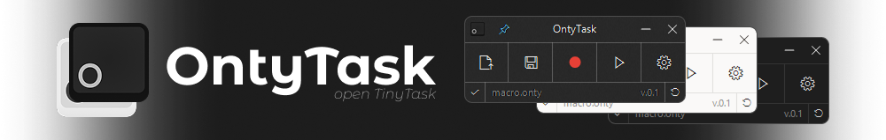

<div align="center">
    <kbd>🪶 Super Light (&lt;512 KB)</kbd>
    <kbd>⚡ Instant & Fast</kbd>
    <kbd>🎮 3D Games & Camera</kbd>
    <kbd>📂 100% Open Source</kbd>
    <br><br>
    
    <br><h1 align="center">&nbsp;&nbsp;&nbsp;&nbsp; $\Huge{\textsf{OntyTask}}$ <sup><sup><kbd>v0.1</kbd></sup></sup></h1>
    <p><b>Super-light, fast, and simple macro recorder for Windows.</b><br>
    <i>A fresh, modern, and open-source alternative to TinyTask.</i></p>
    <a href="#-how-to-build"><b><kbd> <br> ⏳ Coming Soon <br> </kbd></b></a>
    <a href="#-quick-start"><b><kbd> <br> ⚡ Quick Start <br> </kbd></b></a>
    <a href="#-features"><b><kbd> <br> ✨ Features <br> </kbd></b></a>
    <a href="#-ontytask-vs-tinytask"><b><kbd> <br> 📊 Comparison <br> </kbd></b></a>
    <a href="#-how-to-build"><b><kbd> <br> 🛠️ Building <br> </kbd></b></a>
    <h2></h2>
</div>

## What is OntyTask?

**OntyTask** is a lightweight, zero-install macro recorder for Windows. Inspired by TinyTask, it brings full 3D game support, smoother input capture, and a modernized user experience.

---

## Features

- **Records Everything**: Clicks, drags, mouse wheel scrolls, typing, and **3D camera turns**.
- **Universal Hotkeys**: Rebind Record and Play to any single key (<kbd>F8</kbd>, <kbd>PrtScn</kbd>) or **custom modifier combo**.
- **Flexible Speeds**: Slow it down (`0.5x`), keep it real-time (`1x`), speed it up (`up to 100x Turbo`), instant mode, or custom (`0.01x` to `1000x`).
- **Playback Loops**: Quick presets (`1`, `2`, `3`, `5`, `10`, `100`...), loop forever (`∞`), or set an exact count.
- **Emergency Stop**: Configurable panic stop via <kbd>Pause</kbd>, <kbd>Scroll Lock</kbd>, <kbd>Escape</kbd>, or physical mouse movement.
- **Smart Status Bar**: Floating on-screen HUD that shows real-time progress and dodges your mouse cursor.
- **System Tray Support**: Minimize to tray with quick controls, theme matching, and auto-minimize option.
- **Clean Themes**: Dark mode, Light mode, and Windows Acrylic blur.
- **File Association**: Double-click `.onty` files to open and play macros right away.
- **Multi-Language**: Built-in English and Russian, plus custom JSON translations.

---

## OntyTask vs TinyTask

| Feature               |    TinyTask (v1.77)     |       OntyTask (v0.1)       | Notes                                                        |
| :-------------------- | :---------------------: | :-------------------------: | :----------------------------------------------------------- |
| **License**           | Proprietary (Abandoned) |   **Open Source (GPL-3)**   | 100% transparent and safe                                    |
| **Input Capture**     |   10ms Timer Polling    |    **Hooks + Raw Input**    | No dropped keys or jitter                                    |
| **3D Games & Camera** |          ✕ No           |          **✓ Yes**          | Works with locked cursor                                     |
| **Standalone .EXE**   |         ~ Yes*          |      ✕ No (by design)       | Avoids antivirus false flags; uses safer `.onty` files       |
| **Hotkeys**           |    Preset list only     |    **Any key or combo**     | Full custom rebinding                                        |
| **Emergency Stop**    |        Fixed key        |      **Configurable**       | Pause, Scroll Lock, Esc, or mouse move                       |
| **File Format**       |      Binary `.rec`      |     **JSON (`.onty`)**      | Human-readable and editable                                  |
| **Themes & UI**       |      Classic Win32      | **Dark / Light / Acrylic**  | Modern look and vector UI                                    |
| **Status Overlay**    |     Title text only     |      **Floating HUD**       | Evasive on-screen bar                                        |
| **Languages**         |        English**        | **English, Russian + JSON** | Switchable on the fly                                        |
| **Architecture**      |       32-bit only       |      **64-bit (x64)**       | Native modern binary                                         |
| **File Size**         |       **~35 KB**        |         &lt;512 KB          | TinyTask is smaller; OntyTask includes UI themes & Raw Input |

\* Standalone `.exe` generators frequently trigger antivirus false alarms; OntyTask uses a cleaner and safer `.onty` file association model.
\*\* Official localized builds existed in the past, but are no longer officially distributed.

---

## Quick Start

### Default Shortcuts

| Action            |                          Default Shortcut                          | Notes                                                    |
| :---------------- | :----------------------------------------------------------------: | :------------------------------------------------------- |
| **Record / Stop** | <kbd>Ctrl</kbd> + <kbd>Shift</kbd> + <kbd>Alt</kbd> + <kbd>R</kbd> | Starts/stops recording (can be changed to anything else) |
| **Play / Stop**   | <kbd>Ctrl</kbd> + <kbd>Shift</kbd> + <kbd>Alt</kbd> + <kbd>P</kbd> | Starts/stops playback (can be changed to anything else)  |
| **Panic Stop**    |             <kbd>Pause</kbd> / <kbd>Scroll Lock</kbd>              | Instantly stops playback if you need to abort            |

### How to Use

1. **Record**: Hit the Record shortcut (or click the red circle). Do your actions with mouse and keyboard.
2. **Stop**: Hit the Record shortcut again (or click Stop).
3. **Play**: Hit the Play shortcut (or click Play) to watch it run.
4. **Save**: Click Save to store your macro as a `.onty` file.
5. **Settings**: Click Menu (or right-click) to change playback speed, loop count, hotkeys, theme, and more.

---

## How to Build

If you want to compile OntyTask yourself:

1. Install **Visual Studio** with the **Desktop development with C++** workload (C++20).
2. Open Developer PowerShell and run:

```powershell
# Build 64-bit version (Recommended)
msbuild OntyTask.vcxproj /p:Configuration=Release /p:Platform=x64

# Build 32-bit version
msbuild OntyTask.vcxproj /p:Configuration=Release /p:Platform=x86
```

Your `.exe` file will be generated in `bin/x64/` or `bin/x86/`.

---

## Wiki & Guides

Check out the full [Wiki](wiki/Home.md) for more details and guides:

- 🚀 [Getting Started Guide](wiki/Getting-Started.md) - First steps and interface guide.
- 🎮 [Macro Engine & 3D Games](wiki/Engine.md) - How 3D camera tracking works.
- ⌨️ [Hotkeys & Controls](wiki/Hotkeys.md) - Shortcuts and emergency stop settings.
- 🎨 [Themes & Customization](wiki/Settings.md) - Dark mode, Acrylic blur, and status bar.
- 📄 [The .onty File Format](wiki/Onty-Macro-Format.md) - How macros are stored in JSON.
- 🌐 [Languages & Translations](wiki/Translations.md) - Adding custom languages.
- 📋 [Translation Table & Words](wiki/Translation-Table.md) - All words and text keys.
- 🤖 [Command Line & Automation](wiki/CLI-Automation.md) - Run macros from batch files or shortcuts.
- 📜 [The Story of TinyTask](TinyTask.md) - History, research, and why OntyTask was made.

---

<div align="center">
    <br>
    <b>OntyTask</b> (<b>O</b>pe<b>N</b> <b>T</b>in<b>Y</b> <b>TASK</b>) - <i>Simple, Fast, and Open-Source Automation.</i><br>
    Licensed under <a href="LICENSE">GNU General Public License v3.0</a>.
</div>
